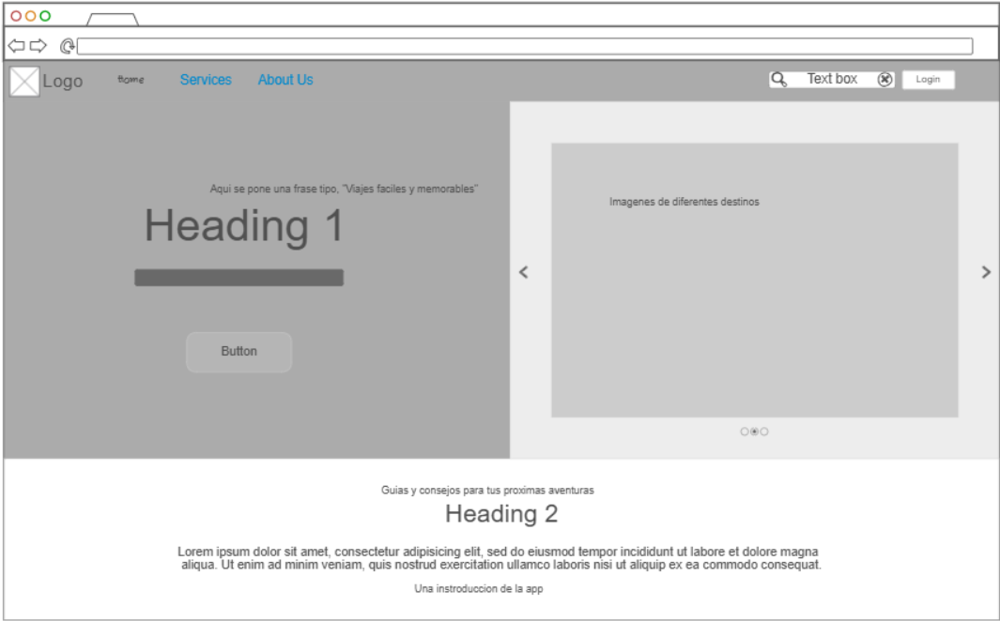
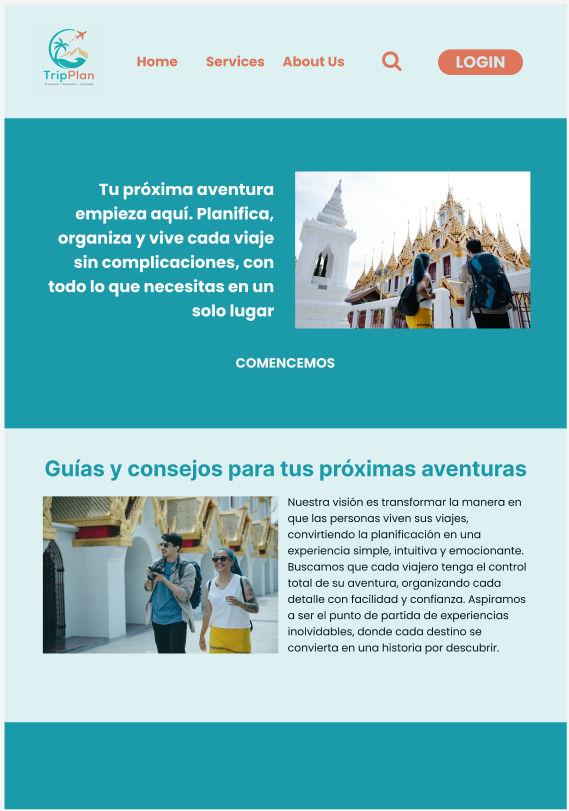

# ✈️ TipPlan - Planificación de Viajes

**TipPlan** es una plataforma web intuitiva diseñada para la organización de viajes, desarrollada como proyecto para la materia de **Diseño de Interfaces** en la **Escuela Politécnica Nacional (EPN)**.

## 🚀 Características
* **Interfaz Responsiva:** Diseño adaptado para móviles (menú hamburguesa), tablets y escritorio.
* **Navegación UX:** Acceso rápido a servicios y retorno al inicio mediante el logo.
* **Estética Moderna:** Uso de variables CSS para una paleta de colores coherente y profesional.

## 🛠️ Tecnologías Utilizadas
* **HTML5 & CSS3:** Estructura semántica y diseño con metodología BEM.
* **JavaScript:** Interactividad para el manejo del menú responsivo.
* **Git/GitHub:** Flujo de trabajo colaborativo mediante ramas y Pull Requests.

## 🎨 Diseño y Prototipado

### Vista Previa (Live Demo)

* **Desktop:**

* **Mobile:**

### Proceso de Diseño
| Wireframe Inicial | Mockup de Alta Fidelidad |
| :---: | :---: |
|  |  |

> **Nota:** Puedes ver el prototipo interactivo en (https://www.figma.com/proto/k5nU6J98ineXhuR97WsUxN/proyecto?node-id=2-26&p=f&t=vfb5XFTvXE6T5vxe-1&scaling=scale-down&content-scaling=fixed&page-id=0%3A1).

## 👥 Equipo de Desarrollo

El proyecto se desarrolla bajo el marco de trabajo Scrum, con los siguientes roles definidos:

* **Ivory Paulina Cando Tonato** - *Scrum Master*
  * Facilitadora del equipo, encargada de asegurar el cumplimiento de los procesos y la eliminación de impedimentos.
* **Maria Fernanda Rodriguez Loachamin** - *Product Manager*
  * Responsable de la visión del producto, definición de requerimientos y priorización del backlog.
* **Francisco Paul Lanche Flores** - *Developer*
  * Desarrollo de la arquitectura base, administración del repositorio en GitHub y revisión de código.
* **Alan Javier Reyes Casierra** - *Developer*
  * Implementación de componentes de interfaz, lógica de negocio y estilos responsivos.

---
© 2026 - Escuela Politécnica Nacional
